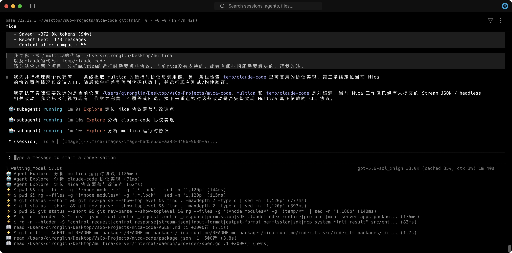

#  Mica Code

> **MICA — Minimal, Intelligent, Cache-first Agent.**
>
> 一个轻量、终端原生、擅长复用上下文的 AI coding agent。



## 核心优势

- ⚡ **前缀稳定，缓存优先**：会话默认 append-only，尽量锁住 system / history 前缀，长对话仍可维持 96%+ 缓存命中
- ⌨️ **终端原生，不离开 shell**：Ink TUI，信息密度高、键盘优先；多 agent、后台任务、状态一眼可见
- 📎 **文件引用更快**：输入 `@` 即可搜索当前工作区文件，方向键选择后用 Enter 或 Tab 插入
- 🎭 **Role 即工作流**：`/role` 整段替换 system prompt，写码、审查、规划各用一套人格
- 🧩 **工具可拼装**：文件 / 搜索 / shell / 网页 / skills 开箱即用，MCP 接个人脚本与团队服务
- ⏪ **可回退、可压缩**：`/rewind` 可回到所选历史对话节点；有文件检查点时也可恢复文件，`/compact` 在上下文吃紧时收束历史

## 快速开始

### 从 GitHub Release 安装

```bash
curl -fsSL https://github.com/qirong77/mica-code/releases/latest/download/install.sh | sh
mica
```

## 配置模型

首次运行会创建本地配置文件：`~/.mica/config.json`。可以运行 /config 打开配置页面。典型 provider 配置：

```json
{
  "providers": [
    {
      "id": "deepseek",
      "name": "DeepSeek",
      "api_base": "https://api.deepseek.com",
      "protocol": "openai_chat_completions",
      "get_model_url": "https://api.deepseek.com/models",
      "api_key": ""
    },
    {
      "id": "Kimi",
      "name": "Kimi",
      "protocol": "openai_chat_completions",
      "api_base": "https://api.moonshot.cn/v1",
      "models": ["kimi-k2.7", "kimi-k2.7"],
      "api_key": ""
    }
  ],
  "mcpServers": {
    "sequential-thinking": {
      "command": "npx",
      "args": ["-y", "@modelcontextprotocol/server-sequential-thinking"]
    }
  }
}
```

`protocol` 可选：`openai_chat_completions` 或 `openai_responses`；

provider 配置了 `get_model_url`，模型列表会按 OpenAI `/models` 响应格式在运行时获取；

没有动态模型接口时，可以直接配置静态 `models` 数组。

## Headless 执行（Codex 风格）

Mica 的执行协议与 OpenAI Codex 对齐：一次性执行用 `mica exec`（对齐 `codex exec`），常驻会话用 `mica app-server`（对齐 `codex app-server`）。

一次性 headless 执行，默认输出人类可读文本；`--json` 输出与 `codex exec --json` 对齐的 ThreadEvent JSONL（`thread.started`、`turn.started`、`item.started`/`item.updated`/`item.completed`、`turn.completed`、`error`，item 类型 `agent_message`/`reasoning`/`command_execution`）：

```bash
mica exec [--json] [--thinking] [--no-save] [--session <id>] [--dir <cwd>] [--mcp-init-timeout-ms <ms>] "<prompt>"
```

工具调用以 `command_execution` item 投影：调用时 `item.started`（`in_progress`），完成后 `item.completed`（`exit_code` + 聚合输出）。`--thinking` 控制是否投影 `reasoning` item。headless 模式也注册 `TodoWrite`。`--mcp-init-timeout-ms` 可为每个 MCP server 的 connect + tools/list 设置总截止时间，健康 server 仍会并行完成并注册工具。Responses 协议在启用 reasoning effort 时会请求 `summary: "auto"`，让支持该能力的模型产生可流式展示的思考摘要。

对已有会话做上下文压缩（Web Chat / 自动化脚本用）：

```bash
mica compact --session <id> [--dir <cwd>] [--force]
```

`mica compact` 复用交互式 `/compact` 的 `CompactionService`（模型摘要 + 最近轮次保留），完成后把压缩后的 checkpoint 写回会话文件并输出一行 JSON（`ok`、`mode`、`strategy`、before/after token 估计、`savedRatio`，以及供消费方展示压缩后上下文占用的 `contextWindowSize`/`contextUsageRatio` 与 `summarizedCount`/`keptCount`）；会话内容较少时返回 `code: "not_needed"`。`--force` 强制即使历史较短也生成摘要。

一次性的 Git 提交（右键 commit 等一次性消费方用）：

```bash
mica commit [--dir <cwd>]
```

`mica commit` 与交互式 `/commit` 复用同一套确定性分析/提交逻辑（`packages/mica-builtin-commands/git/commitRunner.ts`）：程序先收集 git 变化摘要，再向模型**只发一次请求**生成 commit message（不启用工具、无多轮循环），随后程序自己执行 `git add`/`commit`/`push`，最后输出单行 JSON（`ok`、`commitHash`、`subject`、`commitMessage`、`pushed`，失败时含 `code`/`error`）。

常驻会话进程（桌面 App 用；每会话一个进程，暴露 Codex v2 App Server 协议子集——JSON-RPC 风格 stdio，连续对话跳过进程启动、session 重载和 MCP 重复 init，`turn/steer` 支持 after_iteration 迭代注入）：

```bash
mica app-server [--session <id>] [--dir <cwd>] [--model <id>] [--variant <effort>] [--role <name>]
```

## 远程会话同步（Mica Sync）

`mica daemon` 常驻进程可以把本机所有会话（活跃的 + 历史的）实时镜像到一台中心服务器，然后在浏览器里查看并远程续聊：

```bash
# 1. 在中心服务器部署 mica-sync-server（见 apps/sync/server/README.md）
# 2. 在每台需要接入的机器上启动 daemon（首次运行自动注册）
mica daemon --server http://<server>:5560   # --name 可选，默认用机器 hostname
```

之后打开 `http://<server>:5560/`（或 Nginx 反代路径）即可看到所有机器的会话；点击会话可以实时查看运行进度，也可以直接继续对话（任务回源到对应机器执行，`Agent` 的本地文件、shell、MCP 能力都保留在本机）。注意 Mica Sync 默认无认证，公网部署时建议自行加一层访问保护。

常用命令：`pm2 start node --name mica-sync -- mica-sync-server.mjs --port 5560 --data-dir ... --web-dir ...`（详见 `apps/sync/server/README.md`）。
