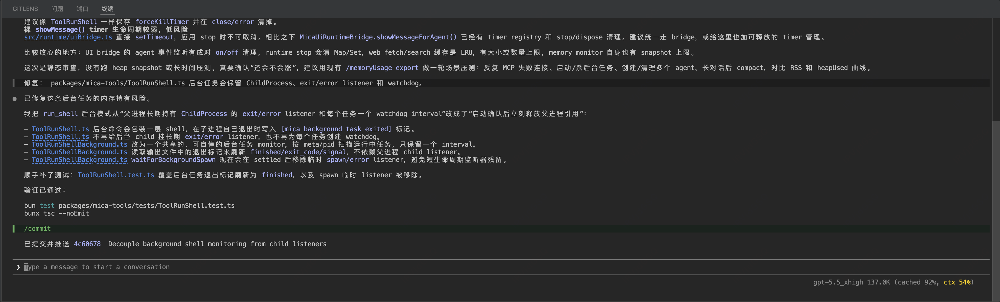

# Mica Code

> **MICA — Minimal, Intelligent, Cache-first Agent.**
>
> 一个轻量、终端原生、擅长复用上下文的 AI coding agent。



## 核心优势

- **Cache-first**：会话历史默认追加演进，尽量保持请求前缀稳定，更容易命中 provider prompt cache。
- **Provider 选择灵活**：支持 OpenAI Chat Completions、OpenAI Responses、Anthropic Messages，以及 DeepSeek、Moonshot、OpenAI 兼容网关和自建 provider。
- **上下文透明**：可查看 context window、token 使用、cached token rate，以及系统提示词、对话、工具输出、skills 等上下文占用。
- **更容易恢复**：本地保存 session snapshot，长会话可 `/compact`，误操作可 `/rewind`。
- **扩展友好**：内置文件、搜索、shell、网页、skills 等工具，也能通过 MCP 接入团队或个人工具。

## 快速开始

### 从 GitHub Release 安装

默认安装为 `mica-code`：

```bash
curl -fsSL https://github.com/qirong77/mica-code/releases/latest/download/install.sh | sh
```

## 配置模型

首次运行会创建本地配置文件：`~/.mica/config.json`。

典型 provider 配置：

```json
{
  "id": "deepseek",
  "name": "DeepSeek",
  "api_base": "https://api.deepseek.com",
  "protocol": "openai_chat_completions",
  "get_model_url": "https://api.deepseek.com/models",
  "api_key": ""
}
```

`protocol` 可选：`openai_chat_completions` 或 `openai_responses`。如果 provider 配置了 `get_model_url`，模型列表会按 OpenAI `/models` 响应格式在运行时获取；没有动态模型接口时，可以直接配置静态 `models` 数组。

## 自定义 Role

使用 `/role` 可以切换当前 agent 的系统提示词。自定义 role 默认放在 `~/.mica/role`，每个普通文件的文件名就是 role 名称，文件内容就是对应的系统提示词；设置 `MICA_HOME` 时目录改为 `$MICA_HOME/role`。

内置 `default` 始终显示在 role 列表中，使用 Mica 自带提示词，不会出现在 role 目录里，也不能被同名文件覆盖。切换 role 只替换系统提示词主体，项目说明、skills 索引和环境 context 等注入保持不变。role 名称会随 session snapshot 保存，`/resume`、`/fork` 和 `/rewind` 都会恢复或继承它；旧 session 或已删除的自定义 role 会回退到 `default`。
